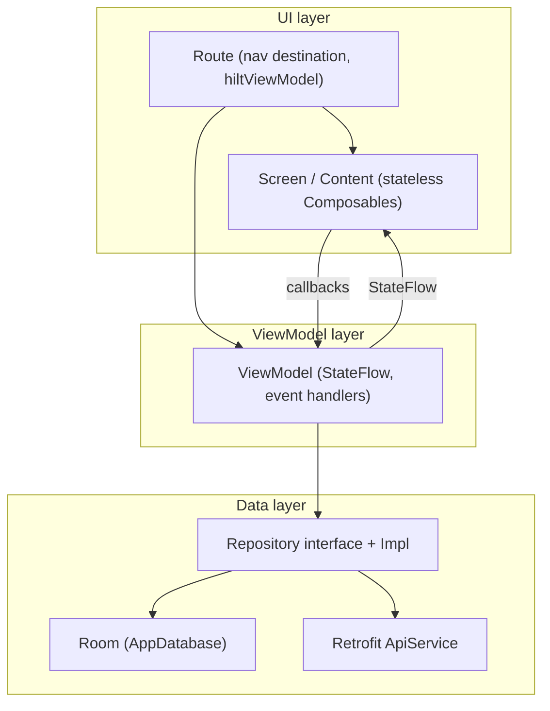
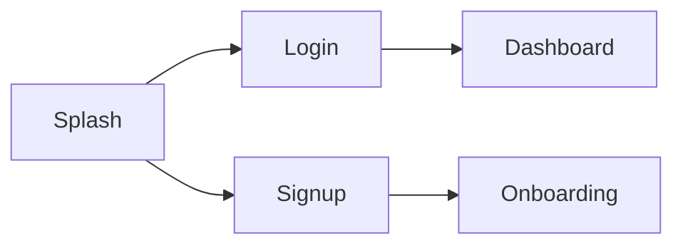

# Kisaan — Android App

Android client for the **Kisaan** tube well irrigation management platform. Built with Jetpack Compose and a clean MVVM architecture.

> Repo: `https://github.com/vaibhavkabadwal03/Kisaan` · Part of the [kisaan-app-full-stack](../README.md) monorepo.

---

## Tech Stack

| Layer | Technology | Version |
| ----- | ---------- | ------- |
| Language | Kotlin | 2.1.0 |
| UI | Jetpack Compose (Material 3) | BOM 2025.05.00 |
| Architecture | MVVM + StateFlow | — |
| Local DB | Room (KSP) | 2.7.1 |
| DI | Hilt | 2.51.1 |
| Networking | Retrofit + Gson | 2.9.0 |
| HTTP client | OkHttp (logging interceptor) | 4.12.0 |
| Navigation | Navigation Compose | 2.7.7 |
| Build | AGP / Gradle | 8.13.2 / 8.13 |
| Min / Target SDK | 24 / 36 | — |

---

## Architecture



Each feature uses a fixed 5-file pattern — `Route` / `Screen` / `Content` / `ViewModel` / `UIState` — see [`guides/architecture.md`](../guides/architecture.md#3-frontend-internals-kisaan).

## Project Structure

```
app/src/main/java/com/kisaan/tubewell/
├── KisaanApp.kt              # @HiltAndroidApp
├── MainActivity.kt           # entry activity
├── core/
│   ├── navigation/           # Routes + KisaanNavGraph
│   └── designsystem/         # theme, typography, components (AppTextField, PrimaryButton, …)
├── data/
│   ├── AppDatabase.kt        # Room DB (10 entities)
│   ├── local/
│   │   ├── entity/           # Farmer, Tubewell, Village, Gramsabha, Operator, Payment, Usage, Borrow, Schedule, Complaint
│   │   └── dao/              # one Flow-based DAO per entity
│   ├── remote/
│   │   ├── api/ApiService.kt # Retrofit interface
│   │   └── model/            # remote DTOs
│   └── repository/           # FarmerRepository (+ Impl)
├── di/                       # Hilt modules (Database, Network, Repository)
└── feature/                  # splash, login, signup
```

## Build & Run

```bash
# Prerequisites: JDK 17, Android Studio Ladybug+
open Kisaan          # then Run ▶ on an emulator (API 24+) or device
```

Build from the CLI:

```bash
./gradlew assembleDebug
```

## Screens & Navigation



- Routes defined in `core/navigation/Routes.kt`; wired so far: splash → login → signup.
- Implemented features: **splash** (2s → routes to signup), **login** (mobile + password, button enable validation), **signup** (Farmer/Operator tab via `SegmentedControl`, form fields).

## Data Layer

- Room is the single local source; DAOs return `Flow` for reactive UI.
- The 10 entity tables mirror the backend PostgreSQL schema 1:1 (same camelCase fields).
- Networking is **not yet wired**: `ApiService` declares `GET /farmers` and `GET /farmers/{id}`, but `NetworkModule` and token storage are pending (see [`TODO.md`](../TODO.md)).

## Roadmap

See [`../TODO.md`](../TODO.md) → *Frontend* section: auth wiring (login/signup → API, JWT storage), Retrofit config, dashboard/onboarding/review screens, offline-first sync.
